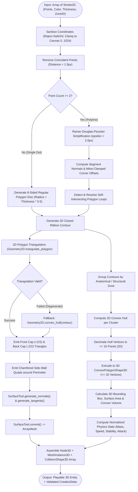

# 05. 2D-to-3D Mesh & Collision Conversion Pipeline

## Mathematical & Algorithmic Pipeline (`MeshExtruder3D` & `CollisionBuilder3D`)

```mermaid
flowchart TD
    Start(["Input: Array of Stroke2D (Points, Color, Thickness, ZoneID)"]) --> Sanitize["Sanitize Coordinates (Reject NaN/Inf, Clamp to Canvas 0..1024)"]
    Sanitize --> Dedupe["Remove Coincident Points (Distance < 1.5px)"]
    Dedupe --> CheckCount{"Point Count >= 2?"}
    CheckCount -- "No (Single Dot)" -->StampCircle["Generate 8-Sided Regular Polygon Disc (Radius = Thickness * 0.5)"]
    CheckCount -- "Yes (Polyline)" --> RunRDP["Ramer-Douglas-Peucker Simplification (epsilon = 2.0px)"]

    StampCircle --> OffsetOutline["Generate 2D Closed Ribbon Contour"]
    RunRDP --> MitreCalc["Compute Segment Normals & Mitre-Clamped Corner Offsets"]
    MitreCalc --> SelfIntCheck["Detect & Resolve Self-Intersecting Polygon Loops"]
    SelfIntCheck --> OffsetOutline

    OffsetOutline --> EarClip["2D Polygon Triangulation (Geometry2D.triangulate_polygon)"]
    EarClip --> CheckTri{"Triangulation Valid?"}
    CheckTri -- "Failed (Degenerate)" --> ConvexFallback["Fallback: Geometry2D.convex_hull(contour)"]
    CheckTri -- "Success" --> BuildCaps["Emit Front Cap (+Z/2) & Back Cap (-Z/2) Triangles"]
    ConvexFallback --> BuildCaps

    BuildCaps --> BuildBevel["Emit Chamfered Side-Wall Quads around Perimeter"]
    BuildBevel --> CalcNormals["SurfaceTool.generate_normals() & generate_tangents()"]
    CalcNormals --> CommitMesh["SurfaceTool.commit() -> ArrayMesh"]

    OffsetOutline --> HullCluster["Group Contours by Anatomical / Structural Zone"]
    HullCluster --> Hull2D["Compute 2D Convex Hull per Cluster"]
    Hull2D --> DecimateHull["Decimate Hull Vertices to <= 16 Points (2D)"]
    DecimateHull --> ExtrudeHull["Extrude to 3D ConvexPolygonShape3D (<= 32 Vertices)"]
    ExtrudeHull --> CalcVolume["Calculate 3D Bounding Box, Surface Area & Convex Volume"]

    CommitMesh --> Assemble["Assemble Node3D + MeshInstance3D + CollisionShape3D Array"]
    CalcVolume --> ComputeStats["Compute Normalized Physics Stats (Mass, Speed, Stability, Attack)"]
    ComputeStats --> Assemble
    Assemble --> End(["Output: Playable 3D Entity + Validated CreationData"])
```
