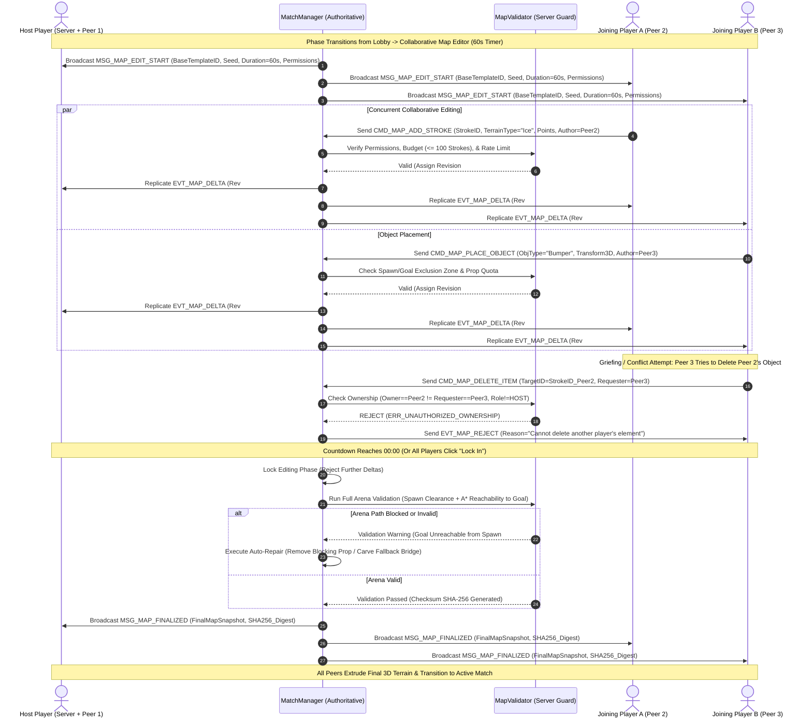

# 06. Collaborative Map Editing Workflow

## Real-Time Multi-User Arena Drawing & Object Placement Sequence

```mermaid
sequenceDiagram
    autonumber
    actor Host as Host Player (Server + Peer 1)
    participant MM as MatchManager (Authoritative)
    participant MV as MapValidator (Server Guard)
    actor ClientA as Joining Player A (Peer 2)
    actor ClientB as Joining Player B (Peer 3)

    Note over Host,ClientB: Phase Transitions from Lobby -> Collaborative Map Editor (60s Timer)
    MM->>Host: Broadcast MSG_MAP_EDIT_START (BaseTemplateID, Seed, Duration=60s, Permissions)
    MM->>ClientA: Broadcast MSG_MAP_EDIT_START (BaseTemplateID, Seed, Duration=60s, Permissions)
    MM->>ClientB: Broadcast MSG_MAP_EDIT_START (BaseTemplateID, Seed, Duration=60s, Permissions)

    par Concurrent Collaborative Editing
        ClientA->>MM: Send CMD_MAP_ADD_STROKE (StrokeID, TerrainType="Ice", Points, Author=Peer2)
        MM->>MV: Verify Permissions, Budget (<= 100 Strokes), & Rate Limit
        MV-->>MM: Valid (Assign Revision #101)
        MM->>Host: Replicate EVT_MAP_DELTA (Rev #101, AddStroke, Peer2)
        MM->>ClientA: Replicate EVT_MAP_DELTA (Rev #101, ACK, Peer2)
        MM->>ClientB: Replicate EVT_MAP_DELTA (Rev #101, AddStroke, Peer2)
    and Object Placement
        ClientB->>MM: Send CMD_MAP_PLACE_OBJECT (ObjType="Bumper", Transform3D, Author=Peer3)
        MM->>MV: Check Spawn/Goal Exclusion Zone & Prop Quota
        MV-->>MM: Valid (Assign Revision #102)
        MM->>Host: Replicate EVT_MAP_DELTA (Rev #102, PlaceObject, Peer3)
        MM->>ClientA: Replicate EVT_MAP_DELTA (Rev #102, PlaceObject, Peer3)
        MM->>ClientB: Replicate EVT_MAP_DELTA (Rev #102, ACK, Peer3)
    end

    Note over ClientA,ClientB: Griefing / Conflict Attempt: Peer 3 Tries to Delete Peer 2's Object
    ClientB->>MM: Send CMD_MAP_DELETE_ITEM (TargetID=StrokeID_Peer2, Requester=Peer3)
    MM->>MV: Check Ownership (Owner==Peer2 != Requester==Peer3, Role!=HOST)
    MV-->>MM: REJECT (ERR_UNAUTHORIZED_OWNERSHIP)
    MM->>ClientB: Send EVT_MAP_REJECT (Reason="Cannot delete another player's element")

    Note over Host,ClientB: Countdown Reaches 00:00 (Or All Players Click "Lock In")
    MM->>MM: Lock Editing Phase (Reject Further Deltas)
    MM->>MV: Run Full Arena Validation (Spawn Clearance + A* Reachability to Goal)
    alt Arena Path Blocked or Invalid
        MV-->>MM: Validation Warning (Goal Unreachable from Spawn #3)
        MM->>MM: Execute Auto-Repair (Remove Blocking Prop / Carve Fallback Bridge)
    else Arena Valid
        MV-->>MM: Validation Passed (Checksum SHA-256 Generated)
    end

    MM->>Host: Broadcast MSG_MAP_FINALIZED (FinalMapSnapshot, SHA256_Digest)
    MM->>ClientA: Broadcast MSG_MAP_FINALIZED (FinalMapSnapshot, SHA256_Digest)
    MM->>ClientB: Broadcast MSG_MAP_FINALIZED (FinalMapSnapshot, SHA256_Digest)
    Note over Host,ClientB: All Peers Extrude Final 3D Terrain & Transition to Active Match
```
