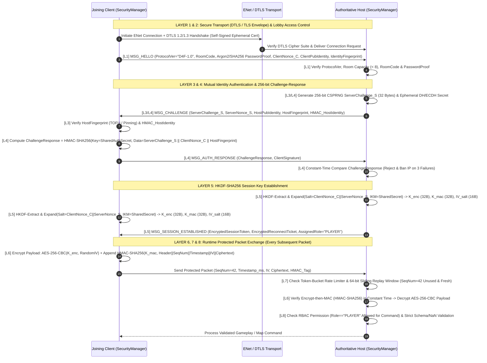

# 09. Eight-Layer Security Handshake

## Cryptographic Authentication, Key Exchange, and Packet Protection Protocol

```mermaid
sequenceDiagram
    autonumber
    participant Client as Joining Client (SecurityManager)
    participant Transport as ENet / DTLS Transport
    participant Host as Authoritative Host (SecurityManager)

    Note over Client,Host: LAYER 1 & 2: Secure Transport (DTLS / TLS Envelope) & Lobby Access Control
    Client->>Transport: Initiate ENet Connection + DTLS 1.2/1.3 Handshake (Self-Signed Ephemeral Cert)
    Transport->>Host: Verify DTLS Cipher Suite & Deliver Connection Request
    Client->>Host: [L1] MSG_HELLO (ProtocolVer="D4F-1.0", RoomCode, Argon2/SHA256 PasswordProof, ClientNonce_C, ClientPubIdentity, IdentityFingerprint)
    Host->>Host: [L1] Verify ProtocolVer, Room Capacity (< 8), RoomCode & PasswordProof

    Note over Client,Host: LAYER 3 & 4: Mutual Identity Authentication & 256-bit Challenge-Response
    Host->>Host: [L3/L4] Generate 256-bit CSPRNG ServerChallenge_S (32 Bytes) & Ephemeral DH/ECDH Secret
    Host->>Client: [L3/L4] MSG_CHALLENGE (ServerChallenge_S, ServerNonce_S, HostPubIdentity, HostFingerprint, HMAC_HostIdentity)
    Client->>Client: [L3] Verify HostFingerprint (TOFU / Pinning) & HMAC_HostIdentity
    Client->>Client: [L4] Compute ChallengeResponse = HMAC-SHA256(Key=SharedAuthSecret, Data=ServerChallenge_S || ClientNonce_C || HostFingerprint)
    Client->>Host: [L4] MSG_AUTH_RESPONSE (ChallengeResponse, ClientSignature)
    Host->>Host: [L4] Constant-Time Compare ChallengeResponse (Reject & Ban IP on 3 Failures)

    Note over Client,Host: LAYER 5: HKDF-SHA256 Session Key Establishment
    Host->>Host: [L5] HKDF-Extract & Expand(Salt=ClientNonce_C||ServerNonce_S, IKM=SharedSecret) -> K_enc (32B), K_mac (32B), IV_salt (16B)
    Client->>Client: [L5] HKDF-Extract & Expand(Salt=ClientNonce_C||ServerNonce_S, IKM=SharedSecret) -> K_enc (32B), K_mac (32B), IV_salt (16B)
    Host->>Client: [L5] MSG_SESSION_ESTABLISHED (EncryptedSessionToken, EncryptedReconnectTicket, AssignedRole="PLAYER")

    Note over Client,Host: LAYER 6, 7 & 8: Runtime Protected Packet Exchange (Every Subsequent Packet)
    Client->>Client: [L6] Encrypt Payload: AES-256-CBC(K_enc, RandomIV) + Append HMAC-SHA256(K_mac, Header||SeqNum||Timestamp||IV||Ciphertext)
    Client->>Host: Send Protected Packet (SeqNum=42, Timestamp_ms, IV, Ciphertext, HMAC_Tag)
    Host->>Host: [L7] Check Token-Bucket Rate Limiter & 64-bit Sliding Replay Window (SeqNum=42 Unused & Fresh)
    Host->>Host: [L6] Verify Encrypt-then-MAC (HMAC-SHA256) in Constant Time -> Decrypt AES-256-CBC Payload
    Host->>Host: [L8] Check RBAC Permission (Role=="PLAYER" Allowed for Command) & Strict Schema/NaN Validation
    Host-->>Client: Process Validated Gameplay / Map Command
```
