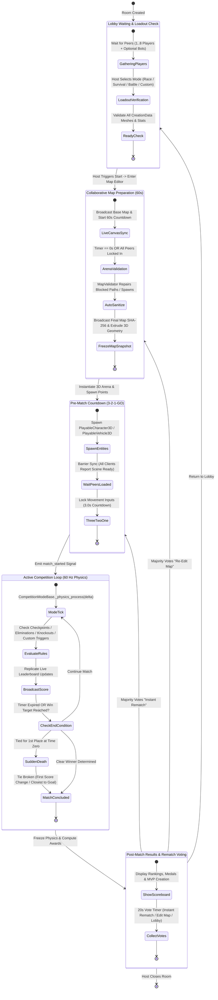

# 10. Competition Match Lifecycle

## Authoritative Match State Machine (`MatchManager` & `CompetitionModeBase`)

```mermaid
stateDiagram-v2
    [*] --> LobbyWaiting: Room Created

    state "Lobby Waiting & Loadout Check" as LobbyWaiting {
        [*] --> GatheringPlayers: Wait for Peers (1..8 Players + Optional Bots)
        GatheringPlayers --> LoadoutVerification: Host Selects Mode (Race / Survival / Battle / Custom)
        LoadoutVerification --> ReadyCheck: Validate All CreationData Meshes & Stats
        ReadyCheck --> [*]
    }

    LobbyWaiting --> CollaborativePrep: Host Triggers Start -> Enter Map Editor

    state "Collaborative Map Preparation (60s)" as CollaborativePrep {
        [*] --> LiveCanvasSync: Broadcast Base Map & Start 60s Countdown
        LiveCanvasSync --> ArenaValidation: Timer == 0s OR All Peers Locked In
        ArenaValidation --> AutoSanitize: MapValidator Repairs Blocked Paths / Spawns
        AutoSanitize --> FreezeMapSnapshot: Broadcast Final Map SHA-256 & Extrude 3D Geometry
        FreezeMapSnapshot --> [*]
    }

    CollaborativePrep --> ArenaLoading: Instantiate 3D Arena & Spawn Points

    state "Pre-Match Countdown (3-2-1-GO)" as ArenaLoading {
        [*] --> SpawnEntities: Spawn PlayableCharacter3D / PlayableVehicle3D
        SpawnEntities --> WaitPeersLoaded: Barrier Sync (All Clients Report Scene Ready)
        WaitPeersLoaded --> ThreeTwoOne: Lock Movement Inputs (3.0s Countdown)
        ThreeTwoOne --> [*]
    }

    ArenaLoading --> ActiveCompetition: Emit match_started Signal

    state "Active Competition Loop (60 Hz Physics)" as ActiveCompetition {
        [*] --> ModeTick: CompetitionModeBase._physics_process(delta)
        ModeTick --> EvaluateRules: Check Checkpoints / Eliminations / Knockouts / Custom Triggers
        EvaluateRules --> BroadcastScore: Replicate Live Leaderboard Updates
        BroadcastScore --> CheckEndCondition: Timer Expired OR Win Target Reached?
        CheckEndCondition --> ModeTick: Continue Match
        CheckEndCondition --> SuddenDeath: Tied for 1st Place at Time Zero
        SuddenDeath --> MatchConcluded: Tie Broken (First Score Change / Closest to Goal)
        CheckEndCondition --> MatchConcluded: Clear Winner Determined
        MatchConcluded --> [*]
    }

    ActiveCompetition --> PostMatchPodium: Freeze Physics & Compute Awards

    state "Post-Match Results & Rematch Voting" as PostMatchPodium {
        [*] --> ShowScoreboard: Display Rankings, Medals & MVP Creation
        ShowScoreboard --> CollectVotes: 20s Vote Timer (Instant Rematch / Edit Map / Lobby)
        CollectVotes --> [*]
    }

    PostMatchPodium --> ArenaLoading: Majority Votes "Instant Rematch"
    PostMatchPodium --> CollaborativePrep: Majority Votes "Re-Edit Map"
    PostMatchPodium --> LobbyWaiting: Return to Lobby
    PostMatchPodium --> [*]: Host Closes Room
```
