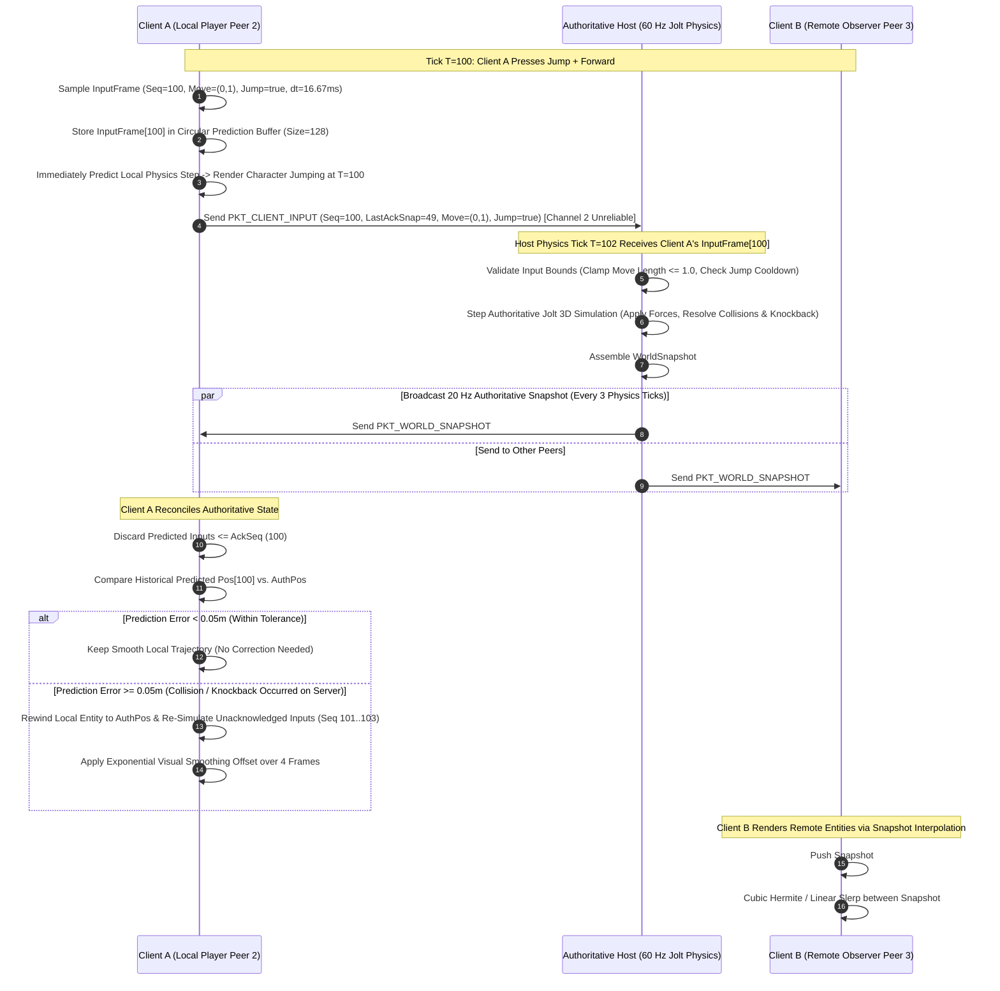

# 11. Game State Synchronization, Prediction, and Interpolation

## Real-Time 60 Hz Input Prediction & 20 Hz Snapshot Reconciliation

```mermaid
sequenceDiagram
    autonumber
    participant ClientA as Client A (Local Player Peer 2)
    participant Host as Authoritative Host (60 Hz Jolt Physics)
    participant ClientB as Client B (Remote Observer Peer 3)

    Note over ClientA,ClientB: Tick T=100: Client A Presses Jump + Forward
    ClientA->>ClientA: Sample InputFrame (Seq=100, Move=(0,1), Jump=true, dt=16.67ms)
    ClientA->>ClientA: Store InputFrame[100] in Circular Prediction Buffer (Size=128)
    ClientA->>ClientA: Immediately Predict Local Physics Step -> Render Character Jumping at T=100
    ClientA->>Host: Send PKT_CLIENT_INPUT (Seq=100, LastAckSnap=49, Move=(0,1), Jump=true) [Channel 2 Unreliable]

    Note over Host: Host Physics Tick T=102 Receives Client A's InputFrame[100]
    Host->>Host: Validate Input Bounds (Clamp Move Length <= 1.0, Check Jump Cooldown)
    Host->>Host: Step Authoritative Jolt 3D Simulation (Apply Forces, Resolve Collisions & Knockback)
    Host->>Host: Assemble WorldSnapshot #50 (ServerTick=102, AckSeq_Peer2=100, All Entity Transforms, Velocities & Scores)

    par Broadcast 20 Hz Authoritative Snapshot (Every 3 Physics Ticks)
        Host->>ClientA: Send PKT_WORLD_SNAPSHOT #50 (AckSeq=100, AuthPos, AuthVel, RemoteStates)
    and Send to Other Peers
        Host->>ClientB: Send PKT_WORLD_SNAPSHOT #50 (Peer2_Pos, Peer2_Vel, ServerTimestamp)
    end

    Note over ClientA: Client A Reconciles Authoritative State
    ClientA->>ClientA: Discard Predicted Inputs <= AckSeq (100)
    ClientA->>ClientA: Compare Historical Predicted Pos[100] vs. AuthPos
    alt Prediction Error < 0.05m (Within Tolerance)
        ClientA->>ClientA: Keep Smooth Local Trajectory (No Correction Needed)
    else Prediction Error >= 0.05m (Collision / Knockback Occurred on Server)
        ClientA->>ClientA: Rewind Local Entity to AuthPos & Re-Simulate Unacknowledged Inputs (Seq 101..103)
        ClientA->>ClientA: Apply Exponential Visual Smoothing Offset over 4 Frames
    end

    Note over ClientB: Client B Renders Remote Entities via Snapshot Interpolation
    ClientB->>ClientB: Push Snapshot #50 into Interpolation Ring Buffer (Target Render Time = Now - 100ms)
    ClientB->>ClientB: Cubic Hermite / Linear Slerp between Snapshot #49 and Snapshot #50
```
