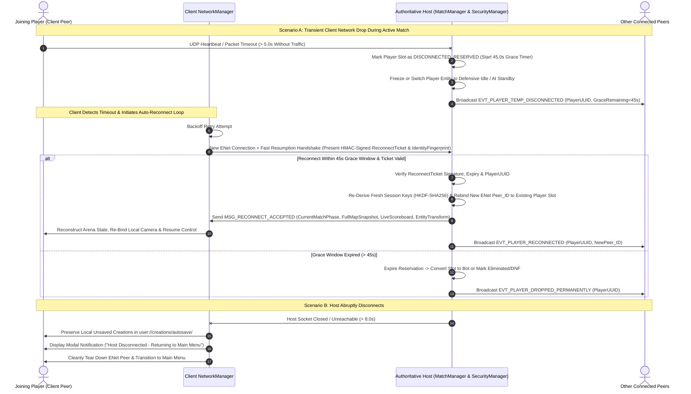

# 12. Disconnect and Reconnection Workflow

## Graceful Recovery, Slot Reservation, and Fast Session Resumption

```mermaid
sequenceDiagram
    autonumber
    actor Client as Joining Player (Client Peer)
    participant NetC as Client NetworkManager
    participant Host as Authoritative Host (MatchManager & SecurityManager)
    actor Others as Other Connected Peers

    Note over Client,Others: Scenario A: Transient Client Network Drop During Active Match
    Client -x Host: UDP Heartbeat / Packet Timeout (> 5.0s Without Traffic)
    Host->>Host: Mark Player Slot as DISCONNECTED_RESERVED (Start 45.0s Grace Timer)
    Host->>Host: Freeze or Switch Player Entity to Defensive Idle / AI Standby
    Host->>Others: Broadcast EVT_PLAYER_TEMP_DISCONNECTED (PlayerUUID, GraceRemaining=45s)

    Note over Client,NetC: Client Detects Timeout & Initiates Auto-Reconnect Loop
    NetC->>NetC: Backoff Retry Attempt #1..#5 (1s, 2s, 4s, 8s) with Stored ReconnectTicket
    NetC->>Host: New ENet Connection + Fast Resumption Handshake (Present HMAC-Signed ReconnectTicket & IdentityFingerprint)

    alt Reconnect Within 45s Grace Window & Ticket Valid
        Host->>Host: Verify ReconnectTicket Signature, Expiry & PlayerUUID
        Host->>Host: Re-Derive Fresh Session Keys (HKDF-SHA256) & Rebind New ENet Peer_ID to Existing Player Slot
        Host->>NetC: Send MSG_RECONNECT_ACCEPTED (CurrentMatchPhase, FullMapSnapshot, LiveScoreboard, EntityTransform)
        NetC->>Client: Reconstruct Arena State, Re-Bind Local Camera & Resume Control
        Host->>Others: Broadcast EVT_PLAYER_RECONNECTED (PlayerUUID, NewPeer_ID)
    else Grace Window Expired (> 45s)
        Host->>Host: Expire Reservation -> Convert Slot to Bot or Mark Eliminated/DNF
        Host->>Others: Broadcast EVT_PLAYER_DROPPED_PERMANENTLY (PlayerUUID)
    end

    Note over Client,Others: Scenario B: Host Abruptly Disconnects
    Host -x NetC: Host Socket Closed / Unreachable (> 8.0s)
    NetC->>Client: Preserve Local Unsaved Creations in user://creations/autosave/
    NetC->>Client: Display Modal Notification ("Host Disconnected - Returning to Main Menu")
    NetC->>Client: Cleanly Tear Down ENet Peer & Transition to Main Menu
```
