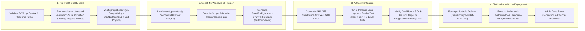

# 13. Windows 10/11 x64 Build and itch.io Release Workflow

## Automated Packaging, Verification, and Deployment Pipeline

```mermaid
flowchart LR
    subgraph Pre_Build["1. Pre-Flight Quality Gate"]
        LINT["Validate GDScript Syntax & Resource Paths"]
        TEST["Run Headless Automated Verification Suite (Creation, Security, Physics, Modes)"]
        RENDER_CFG["Verify project.godot (GL Compatibility + D3D12/OpenGL3 + Jolt Physics)"]
    end

    subgraph Export_Stage["2. Godot 4.x Windows x64 Export"]
        PRESET["Load export_presets.cfg ('Windows Desktop' x86_64)"]
        EMBED["Compile Scripts & Bundle Resources into .pck"]
        BIN["Generate DrawForFight.exe + DrawForFight.pck (build/windows/)"]
    end

    subgraph Smoke_Test["3. Artifact Verification"]
        HASH["Generate SHA-256 Checksums for Executable & PCK"]
        LOOPBACK["Run 2-Instance Local Loopback Smoke Test (Host + Join + 8-Layer Auth)"]
        PERF["Verify Cold Boot < 3.0s & 60 FPS Target on Integrated/Mid-Range GPU"]
    end

    subgraph Release_Stage["4. Distribution & itch.io Deployment"]
        ZIP["Package Portable Archive (DrawForFight-win64-vX.Y.Z.zip)"]
        BUTLER["Execute 'butler push build/windows user/draw-for-fight:windows-x64'"]
        DELTA["itch.io Delta Patch Generation & Channel Promotion"]
    end

    LINT --> TEST
    TEST --> RENDER_CFG
    RENDER_CFG --> PRESET
    PRESET --> EMBED
    EMBED --> BIN
    BIN --> HASH
    HASH --> LOOPBACK
    LOOPBACK --> PERF
    PERF --> ZIP
    ZIP --> BUTLER
    BUTLER --> DELTA
```
